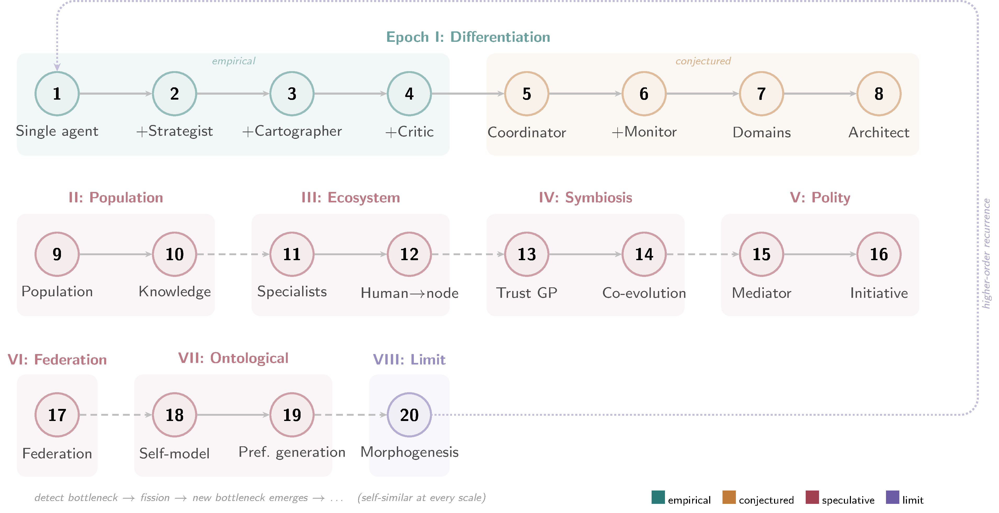

# Architectural Morphogenesis in Autonomous Agent Systems

[[Paper (PDF)](build/main.pdf)]



This repository contains the paper, experiment code, and artifacts for our study on architectural evolution in autonomous agentic systems.

## Abstract

This paper develops a theoretical framework for understanding the architectural evolution of autonomous agentic systems. Drawing on a longitudinal case study in which an LLM-based agent pipeline operated without human intervention for seven days, we identify a recurring phenomenon we term *bottleneck migration*: resolving a performance constraint in one dimension reliably relocates it to another, rather than producing net improvement. We propose a *fission principle* that accounts for the observed pattern of role differentiation in multi-agent architectures, and we formalize the trust relationship between agents and human overseers as a Gaussian Process preference learning problem. The framework extends, in a more speculative register, to populations of agent instances, multi-principal preference aggregation, and co-evolutionary dynamics.

## Repository Structure

```
├── paper/            LaTeX source for the paper
│   ├── main.tex      Main document (ACM sigconf format)
│   ├── sections/     Per-section .tex files
│   ├── references.bib BibTeX bibliography
│   └── figures/      External figures
├── experiments/      Experiment code and scripts
├── artifacts/        Data, logs, and intermediate outputs
├── build/            Compiled PDFs
└── Makefile          Build automation
```

## Experiments

The Wallfacer experiment uses [ralph](https://github.com/changkun/ralph), a Go-based autonomous agent pipeline that runs a think-act-commit loop without human intervention. Each round, three specialized roles execute in sequence:

1. **Thinker**: analyzes the current project state and proposes exactly one concrete goal for the next round.
2. **Worker**: implements the proposed goal directly in the codebase.
3. **Committer**: documents what changed, stages all modifications, and pushes a commit.

Ralph persists execution history as JSON logs in a `.ralph/` directory, enabling the Thinker to condition its next goal on the full trajectory of prior rounds. The pipeline supports Claude Code and OpenAI Codex as LLM backends and can resume from any interrupted round.

We pointed ralph at three empty repositories with no seed task and let it run autonomously. Two instances (Sandbox and Simulator) used the stock Thinker prompt; the third (Explorer) used a modified prompt with an explore/exploit steering signal. All three Thinkers independently converged on building a cellular automaton despite receiving no goal specification. The three resulting codebases then diverged into substantially different artifacts:

| Repository | Language | Lines | Character |
|---|---|---|---|
| [cellular-automaton-sandbox](https://github.com/changkun/cellular-automaton-sandbox) | Python | ~15k | 27 interactive modes across five categories (CA, physics, biology, procedural, algorithms) with a mode-picker menu and demo tour |
| [cellular-automaton-simulator](https://github.com/changkun/cellular-automaton-simulator) | Python | ~12k | 28+ simulation modes with genetic algorithm rule discovery, headless batch rendering, GIF/PNG export, and optional NumPy backend |
| [cellular-automaton-explorer](https://github.com/changkun/cellular-automaton-explorer) | C | ~11k | Deep scientific analysis focus: 15+ information-theoretic overlays (entropy, Lyapunov, transfer entropy, Wolfram classification), multi-rule zones, wormhole portals, and topology modes (torus, Klein bottle, Möbius) |

The Sandbox and Explorer each ran for 42 rounds; the Simulator ran for 33 rounds.

All three are single-file, terminal-based, zero-dependency implementations that share common foundations (Conway's Game of Life, pattern stamping, time-travel replay, RLE import/export, genetic algorithm exploration) yet diverged along different axes. The two stock-prompt instances (Sandbox and Simulator) followed near-parallel breadth-first trajectories, sharing 15 simulation modes. The Explorer, periodically nudged toward exploitation by its steering signal, pursued depth instead, layering 16 scientific analysis overlays onto a single simulation model. This convergence-then-divergence pattern, and the role of a single prompt variable in governing it, is one of the phenomena the paper analyzes.

All experiment repos are included as git submodules under `experiments/`.

## Building the Paper

Requires a TeX distribution with `latexmk` (e.g., TeX Live or MacTeX).

```sh
make paper    # compiles to build/main.pdf
make clean    # removes build artifacts
```

## Citation

```bibtex
@article{ou2025morphogenesis,
  title   = {Architectural Morphogenesis in Autonomous Agent Systems},
  author  = {Ou, Changkun},
  year    = {2026}
}
```

## License

Copyright (c) 2026 Changkun Ou. All rights reserved.
